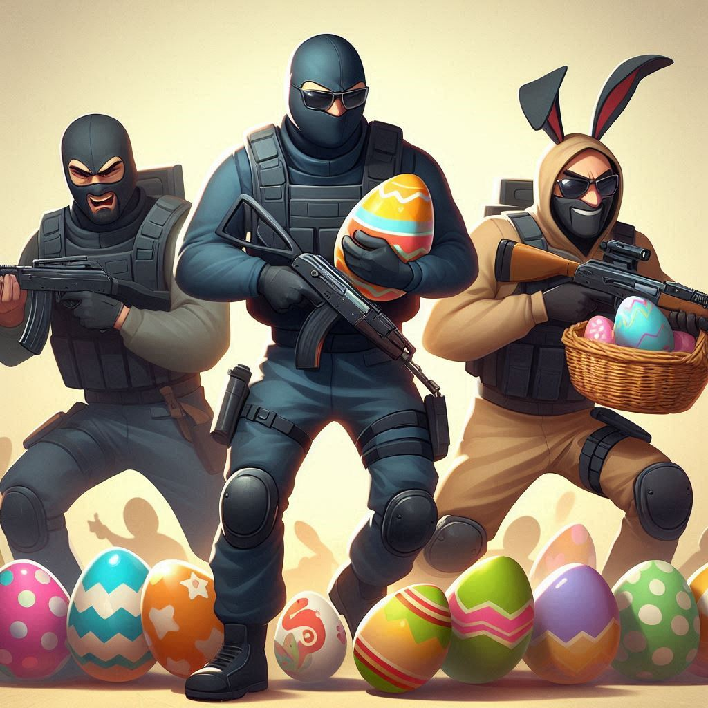

# HuntDownTheEggs

    

A simple Easter egg hunt plugin for Counter-Strike 2 servers using CounterStrikeSharp.  
This plugin allows server owners to place custom easter eggs around the map (which are spawned on round start), drop them when a player is killed, or both. Players can collect these eggs, with all data stored in a MySQL database. 
Additionally, server owners can configure the eggs to grant random rewards by executing custom commands when an egg is picked up. Rewards can be assigned different rarity levels, each with its own drop chance. 

## [📌] Dependiencies
- [Metamod](https://www.sourcemm.net/)
- [CounterStrikeSharp](https://github.com/roflmuffin/CounterStrikeSharp)  

## [📌] Setup
- Install all dependiencies listed upwards,
- Download latest [release](https://github.com/Letaryat/HuntDownTheEggs/releases)
- Drag files to /plugins/
- Restart your server
- Config file should be created in configs/plugins/HuntDownTheEggs,
- After setting up the database restart your server again

If you have any more problems or would like to know more, [please visit wiki.](https://github.com/Letaryat/HuntDownTheEggs/wiki)

## [💖] Special thanks to:
- [Exkludera Gift Packages](https://github.com/exkludera/cs2-gift-packages) - Basically yoinked the whole idea of gifts and how to make presents/triggers/hookentityoutput,
- [CS2-Ranks](https://github.com/partiusfabaa/cs2-ranks), [SimpleAdmin](github.com/daffyyyy/CS2-SimpleAdmin) used as an examples of Dapper and MySQLConnector, 
- CounterStrikeSharp Discord,

### [💥] Model
Unfortunately, no matter how hard I tried porting model from blender, it always ended up with some issues from my part. Because of that I am not providing any easter egg model since the one that I ported was buggy and large in size. I also did not find any cool model in CS2 files to use. If someone would like to share some kinda model of easter egg, easter egg basket or anything connected with easter, please make an issue on github. In my opinion it would be cool if the egg model was as a challenge_coin. Plugin uses loop animation of challenge coin for egg model when idle and it looks pretty :3. 
Thanks!

## [🚨] 
Plugin is written by me. That means it might be poorly written and have some issues. Sometimes I have no idea what am I doing but when tested it works.
It was written using a lot of research and also a chatgpt when I was stuck. Any help and or advice on the code is welcome. Thanks!